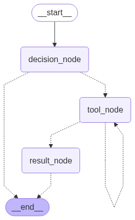

# Multi-Agent NLP Orchestrator

Un agent multi-tâches NLP qui orchestre des modèles de NLP via une API FastAPI.
Il détecte automatiquement la tâche demandée par l’utilisateur et redirige l’input vers le bon outil.

## Fonctionnalités

### Détection automatique des tâches :
L’agent identifie la nature de la requête utilisateur et sélectionne le bon outil parmi :

 - Analyse de sentiment
 - Analyse des émotions
 - Reconnaissance d’entités nommées (NER)

### Orchestration intelligente :
L'agent agit en middleware entre l’utilisateur et mes modèles de NLP.

### Architecture graphée :
Utilise un graphe d’état pour orchestrer :

 - La décision de tâche
 - L’appel des outils NLP
 - L’agrégation des résultats

### Extensible :
Ajoutez facilement de nouveaux modèles/tools.


## Architecture

 Structure du projet :

- `src/` : code source (agent, task)
- `api/` : code source (api fast, pipline d'inference)
- `models/` : modèles enregistrés (.pth)
- `data/` : données utilisées pour l'evaluation
- `performance_evaluation_langgraph.ipynb` : notebook d’évaluation des performances
- `graph.png` : # graphe de l’agent

## Graphe d’exécution :


##  Performance
| Metric   | Score |
|----------| ----- |
| Accuracy | 100%  |
| F1-Score | 1.0   |

Testé sur 50 prompts générés par ChatGPT, couvrant un large éventail de tâches NLP.
Données disponibles : `data/test_data.json` 
Résultats détaillés : `performance_evaluation_langgraph.ipynb`

## Utilisation

### Lancer l’API FastAPI :
```bash
uvicorn run api.api:app --reload
```

### Lancer l’agent:

```bash
python lg_agent.py
```

## Technologies
- LangChain
- LangGraph
- Ollama (LLama3-3B)
- FastAPI
- Python